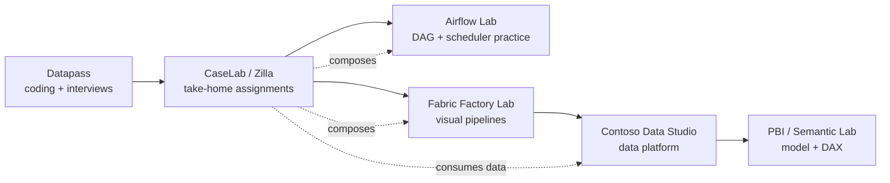
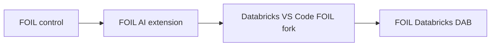
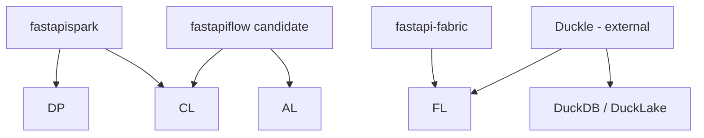

# Data Projects Constellation

Global portfolio registry for Julian's data-engineering, BI, Fabric, Databricks and learning projects.

This repo answers five questions for humans and AI agents:

1. What are the **real products**?
2. What is only a **toolbox, runtime, donor, fork or domain lab**?
3. Which repo owns each capability?
4. What is **current vs planned**?
5. What should be worked on next?

## Authority

- **dataprojects** = global constellation, categories, scope boundaries and status vocabulary.
- Individual application repos = implementation/test truth.
- **datapasscontrol** = detailed sub-registry for the learning-product family; it is not a competing global source of truth.

## Core product family

| Product | Primary purpose | Canonical repo | Current state |
|---|---|---|---|
| Datapass | LeetCode-style DE coding + notebook practice | `julian-passebecq/ducklabms_code` | Qualified broad V1; refocus planned |
| CaseLab / Zilla | Multi-step DE take-home assignments | not assigned | Planned; donor source exists |
| Airflow Lab | Full Airflow-style DAG/scheduler learning | not assigned | Planned |
| Fabric Factory Lab | Fabric/ADF-style pipeline + Mapping Data Flow | not assigned | Donor UI + backend exist; assembly pending |
| Contoso Data Studio | Realistic local lakehouse/warehouse studio | `julian-passebecq/contoso-data-studio` | Early active build |
| PBI / Semantic Lab | Semantic model + DAX + Power BI model learning | not assigned | Planned from existing donors |

See `registry/products/`.

## Supporting toolboxes / IDEs / extensions

These are **not extra core products by default**.

| Tool | Classification | Why it exists |
|---|---|---|
| Fabric DataPass Toolbox | toolbox / VS Code companion | checklist and helpers for real Fabric work |
| Fabric Ops Studio / `fabric-toolbox_J` | fork + ops toolbox donor | Fabric administration/operations/accelerators |
| PbiBench / `powerbi_enhanced_dev` | engineering IDE donor | broad Power BI engineering IDE; donor to focused PBI Lab |
| `TabularEditor_J` | fork/donor | TE2/TOM semantic-model source |
| FOIL Databricks VS Code fork | domain extension fork | FOIL-specific Databricks developer workflow |
| FOIL AI Control Extension | supporting extension | small workspace navigator/binder |

See `registry/tooling.json`.

## Domain family: FOIL

The FOIL repos validate/use the tooling but are not additional general-purpose products.

## Runtime/service layer

## Status vocabulary

- `qualified` — release/test-qualified.
- `active` — actively developed.
- `prototype` — useful implementation exists but scope is moving.
- `planned` — architecture decided; implementation not established.
- `donor` — source exists mainly to be reused elsewhere.
- `fork` — fork of an upstream project.
- `supporting` — helper/tooling component, not a product.
- `frozen` — stable except bug fixes.
- `legacy` — historical/reference only.
- `external` — third-party dependency/reference.

## Simplest visualization

**Do not add MongoDB for this registry.** Project architecture/status is small, versioned data; Git gives us history, diffs and review for free.

Use:

1. JSON in `registry/` as the source of truth.
2. Mermaid in this README for the zero-infrastructure view.
3. Later, if needed, a tiny **static React/Vite dashboard** that reads the JSON and deploys to GitHub Pages or Cloudflare Pages.

Streamlit is fine for a disposable prototype, but a static dashboard is simpler long term because this data does not need a Python server or database.

## AI read order

1. `registry/constellation.json`
2. relevant `registry/products/<id>.json`
3. `registry/tooling.json`, `registry/services.json`, or `registry/domain-projects.json`
4. the owning code repository
5. only then make implementation claims
